# MPC Control Project

The following is a solution for [MPC Control Project](https://github.com/udacity/CarND-MPC-Project) from Term 2 of Udacity's Self Driving Car Nanodegree. Refer to the main repository for compilation and testing instructions.

## The model

I chose a kinematic model similar to the one used in MPC lessons. The state of the vehicle is represented by the following variables:

- 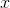,  - cartesian coordinates;
- 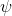 - yaw angle;
-  - velocity.

Two types of commands are used, steering angle  and acceleration . The state update equations look as follows:

- 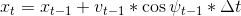
- 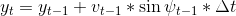
- 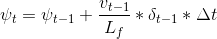
- 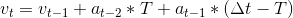

where 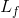 is the wheelbase of the vehicle. Additionally, for each state two error functions are computed:

- 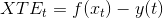
- 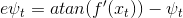

Where  is the polynomial fitted to waypoints.

## Timestep Length and Elapsed Duration (N & dt)

I chose number of steps  to equal 10 and a single time step 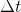 to be equal 0.25s. The choice was dictated primarily by computational efficiency requirements - the controller needs to satisfy hard real time constraints in order to be usable. Previously tried larger values (up to 50) for the number of steps caused increased latency, and in turn overshooting the trajectory and eventually falling of the track.

On the other hand, time step need to be large enough that the prediction window 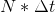 could produce viable commands. Previously it had to be as much as 4s because of small speed of the vehicle. I was able to reduce it (thus increase accuracy) by increasing velocity.

## Model Predictive Control with Latency

To compensate for system latency, state of the system is first projected into the future by a given timestep before being fed to MPC. While this timestep could be a constant equal to the assumed latency of 100ms, it would not account for the time required for computations - which was responsible for about 10% of the total latency on my machine. That's why I decided to compute latency dynamically based on time delta between a message is received from game server and commands are sent.
