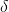
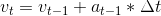

# MPC Control Project

The following is a solution for [MPC Control Project](https://github.com/udacity/CarND-MPC-Project) from Term 2 of Udacity's Self Driving Car Nanodegree. Refer to the main repository for compilation and testing instructions.

## The model

I chose a kinematic model similar to the one used in MPC lessons. The state of the vehicle is represented by the following variables:

- ,  - cartesian coordinates;
-  - yaw angle;
-  - velocity.

Two types of commands are used, steering angle  and acceleration . The state update equations look as follows:

- 
- 
- 
- 

where  is the latency of the system (0.1 s) and  is the wheelbase of the vehicle. Additionally, for each state two error functions are computed:

- 
- 

Where  is the polynomial fitted to waypoints.

## Timestep Length and Elapsed Duration (N & dt)

I chose number of steps  to equal 10 and a single time step  to be equal 4s. The choice was dictated primarily by computational efficiency requirements - the controller needs to satisfy hard real time constraints in order to be usable. Previously tried larger values (up to 50) for the number of steps caused increased latency, and in turn overshooting the trajectory and eventually falling of the track.

On the other hand, time step size was increased in comparison to the original value of 0.1s. The reason for that is that with the prediction window  not being large enough, the model did not look ahead for a distance large enough to produce viable commands. Obviously, increasing size of the time step has negative effect on precision of the system - that's why I stopped increasing it once achieved satisfactory performance.

## Model Predictive Control with Latency

Two methods of compensation for latency are used. First is reducing target velocity in order to minimize distance travelled between a command is issued and executed. Second is the introduction of constant  in state update equations. We assume that for a short period of time after issuing a command, the previously issued command still takes effect.
